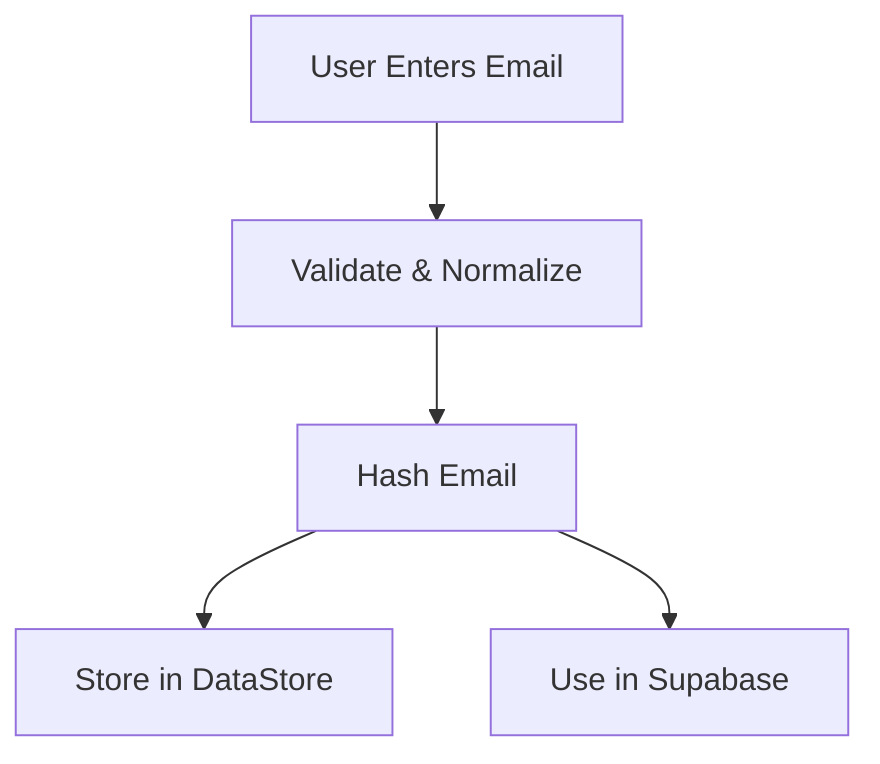

# Email Hashing and Storage Flow

## Overview
This document outlines the secure email handling implementation for the MyPuzzleApp, focusing on privacy-preserving user identification.

## Flow Diagram



## Components

### 1. Email Normalization (`EmailUtils.kt`)
```kotlin
fun normalizeEmail(email: String): String {
    return email.trim().lowercase(Locale.US)
}
```
- Removes leading/trailing spaces
- Converts to lowercase for consistency
- Handles international characters properly

### 2. Email Hashing (`EmailUtils.kt`)
```kotlin
fun hashEmail(email: String): String {
    val normalized = normalizeEmail(email)
    val digest = MessageDigest.getInstance("SHA-256")
    val hashBytes = digest.digest(normalized.toByteArray())
    return "hashed_" + hashBytes.fold("") { str, it -> str + "%02x".format(it) }
}
```
- Uses SHA-256 cryptographic hash function
- Converts bytes to hexadecimal with `%02x` format
- Adds 'hashed_' prefix for identification

### 3. Secure Storage (`UserPreferences.kt`)
```kotlin
suspend fun saveUserEmail(email: String): Boolean {
    return if (EmailUtils.isValidEmail(email)) {
        val hashedEmail = EmailUtils.hashEmail(email)
        preferences.edit {
            it[USER_EMAIL_KEY] = email
            it[HASHED_EMAIL_KEY] = hashedEmail
        }
        true
    } else false
}
```
- Stores both original (local only) and hashed email
- Uses Android's DataStore for secure storage
- Returns boolean for success/failure

### 4. Supabase Integration (`SupabasePuzzleProgressDataSource.kt`)
```kotlin
private suspend fun getHashedEmail(): String {
    return userPreferences.hashedEmail.first()
        ?: throw IllegalStateException("User email not set")
}

// Usage in database operations:
fun saveProgress(progress: Progress) {
    val hashedEmail = getHashedEmail()
    // Use hashedEmail in database queries
}
```
- Only the hashed email is sent to Supabase
- Original email never leaves the device

## Security Considerations

1. **Data Protection**
   - Original emails are never stored remotely
   - Hashing is one-way (cannot be reversed)
   - Local storage uses Android's secure storage

2. **Privacy**
   - No personally identifiable information in logs
   - Hash prefix prevents accidental exposure
   - Normalization prevents duplicate accounts

3. **Performance**
   - Hashing is fast (SHA-256)
   - Minimal storage overhead
   - Efficient for lookups

## Example Flow

1. User enters: `"  User@Example.com "`
2. Normalized: `"user@example.com"`
3. Hashed: `"hashed_5e8848...a8e9"`
4. Stored locally: 
   ```json
   {
     "email": "user@example.com",
     "hashed_email": "hashed_5e8848...a8e9"
   }
   ```
5. Stored in Supabase: 
   ```json
   {
     "user_id": "hashed_5e8848...a8e9",
     "progress_data": {...}
   }
   ```

## Error Handling

| Error Case | Handling |
|------------|----------|
| Invalid Email | Returns false, shows user error |
| Storage Failure | Throws exception, shows error message |
| Network Error | Retries with exponential backoff |

## Future Improvements

1. Add email verification flow
2. Implement rate limiting
3. Add account recovery options
4. Consider using Argon2 for memory-hard hashing

## Testing Notes

Test cases should verify:
- Case insensitivity
- Email normalization
- Hash consistency
- Error conditions
- Storage/retrieval flow
